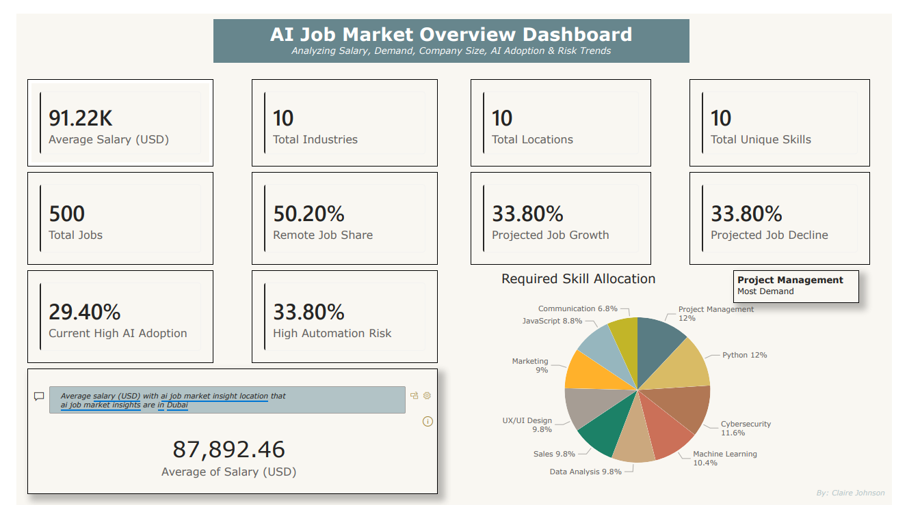
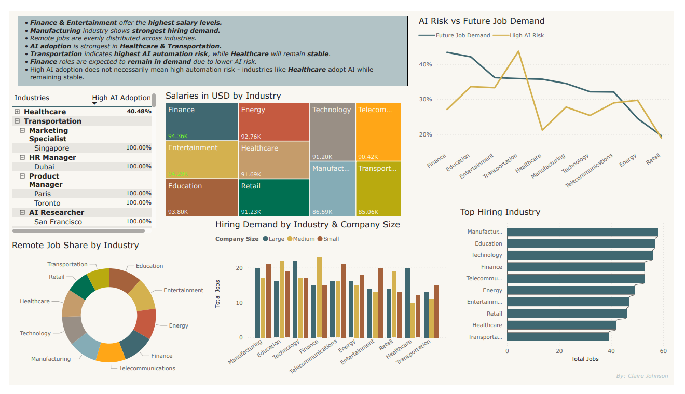
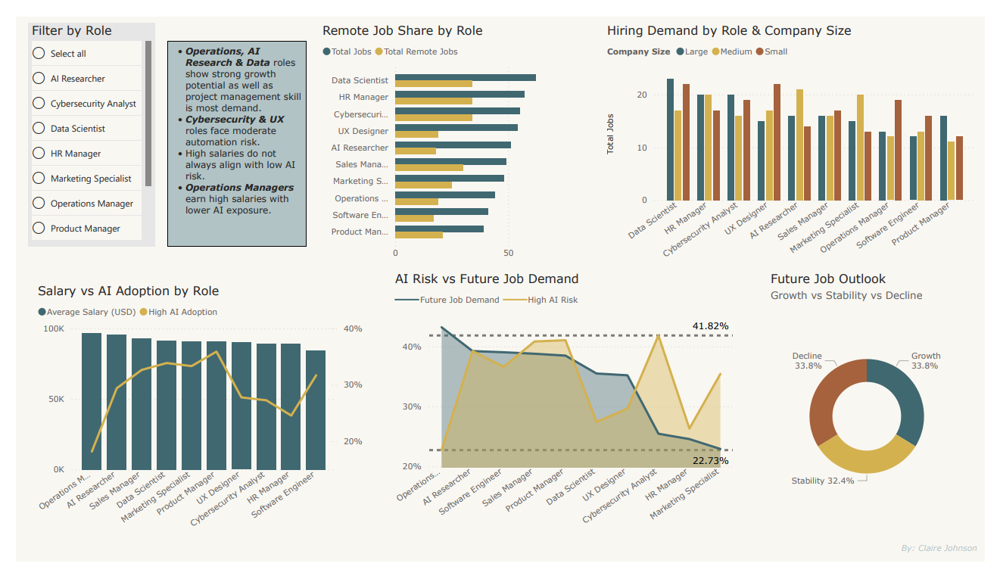
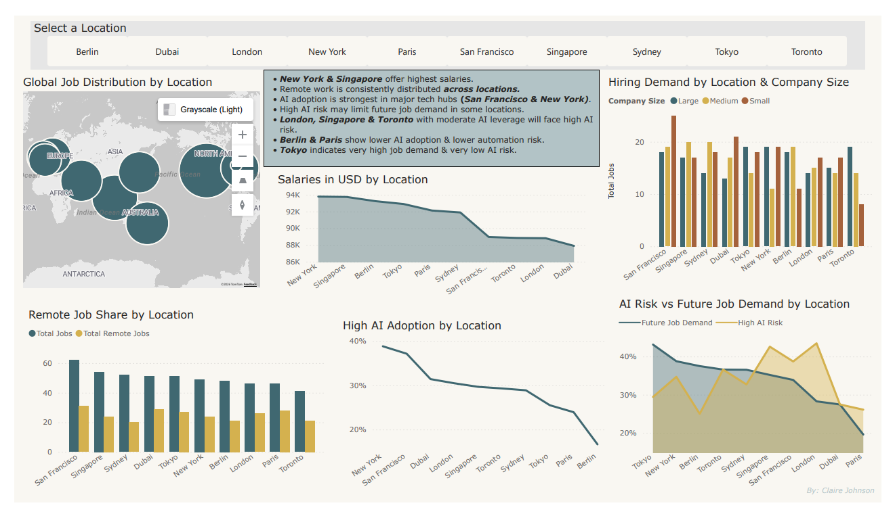

# 📊 AI Job Market Analysis Dashboard

## 🔍 Overview

This Power BI dashboard analyzes the AI job market across industries, roles, and global locations.

It focuses on:

* Salary trends
* Job demand
* AI adoption
* Automation risk

---

## 📌 Key Insights

* Finance & Entertainment offer the highest salaries
* Manufacturing shows the strongest hiring demand
* AI/Data roles show strong growth potential
* High AI adoption ≠ high automation risk
* New York & Singapore lead in salary

---

## 📊 Dashboard Preview

### Overview

### Industry Analysis

### Job Role Analysis

### Location Analysis

---

## 🛠 Tools Used

* Power BI
* DAX
* Data Modeling
* Data Visualization

---

## 📈 Skills Demonstrated

* Dashboard Design
* KPI Development
* Data Storytelling
* Analytical Thinking
* Business Insights

---

## 📎 Project File

* **AI_Powered_Job_Market_Insights.pbix**

This Power BI file contains the complete interactive dashboards, including:

* Data modeling and relationships
* DAX measures and KPIs
* Multi-page analysis (Overview, Industry, Role, Location)

👉 Open in Power BI Desktop to explore all visuals and filters interactively.

---

## 👩‍💻 Author

Claire Johnson
# ai-job-market-dashboard
Power BI dashboard analyzing AI job market trends (salary, demand, AI risk, AI adoption)
